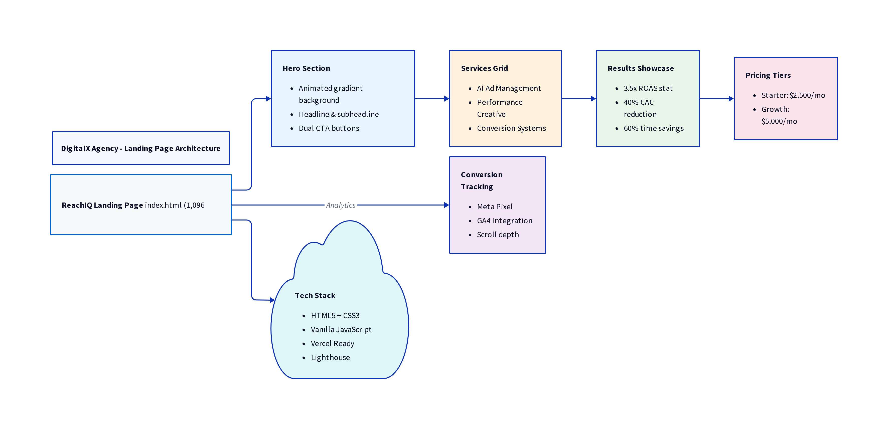

# DigitalX Agency

<p align="center">
  <strong>Premium Digital Marketing Agency Website</strong><br>
  <em>Modern, responsive, and SEO-optimized web presence</em>
</p>

<p align="center">
  
  
  
  
  
  
</p>

---

## 🎬 Demo



**Architecture Overview:** The ReachIQ landing page is a comprehensive 1,096-line HTML5/CSS3 landing page featuring an animated hero section with gradient backgrounds, four core service offerings (AI Ad Management, Performance Creative, Conversion Systems, Growth Strategy), results showcase with case study metrics, tiered pricing (Starter $2,500/mo, Growth $5,000/mo, Enterprise Custom), and full conversion tracking integration with Meta Pixel and GA4.

📖 **[View Full Demo Guide](DEMO.md)** - Complete walkthrough with visual preview and feature breakdown

---

## 🚀 Quick Start

### Installation

1. Clone the repository:
```bash
git clone https://github.com/mbugus94-lang/digitalx-agency.git
cd digitalx-agency
```

2. Install dependencies:
```bash
npm install
```

3. Copy the environment variables file:
```bash
cp .env.example .env
# Edit .env with your configuration
```

4. Start the development server:
```bash
npm start
```

The site will be available at `http://localhost:3000`

---

## 📁 Project Structure

```
digitalx-agency/
├── index.html          # Main landing page
├── package.json        # Dependencies and scripts
├── .env.example        # Environment variables template
├── .gitignore          # Git ignore rules
├── __tests__/          # Test files
├── test/               # Additional tests
└── README.md           # This file
```

---

## 🛠️ Tech Stack

- **Frontend:** HTML5, CSS3, JavaScript
- **Server:** Static site served with `serve`
- **Deployment:** Optimized for Vercel
- **Testing:** Jest, html-validate, Lighthouse CI

---

## 📦 Deployment

### Deploy to Vercel
```bash
# Install Vercel CLI
npm i -g vercel

# Deploy
vercel
```

### Manual Deployment
Simply upload the `index.html` file to any static hosting provider.

---

## 🔧 Customization

1. Edit `index.html` to update content
2. Modify styles within the `<style>` tags
3. Update meta tags for SEO
4. Replace placeholder images with actual assets

---

## ⚙️ Environment Variables

Copy `.env.example` to `.env` and configure:

| Variable | Description | Required |
|----------|-------------|----------|
| `PORT` | Server port | No (default: 3000) |
| `GOOGLE_ANALYTICS_ID` | GA tracking ID | No |

---

## 🧪 Testing

This project includes comprehensive tests:

### Run All Tests
```bash
npm test
```

Tests ensure:
- Proper HTML lang attributes
- Alt text on images
- Semantic heading hierarchy
- Skip-to-content links
- Meta description and keywords
- Open Graph tags
- Canonical links
- Inline CSS performance

### HTML Validation
```bash
npm run lint
```

---

## 🔧 CI/CD

GitHub Actions runs on every push:
- HTML validation
- Accessibility tests
- Lighthouse performance audit
- Code formatting checks

---

## 🐛 Troubleshooting

### Common Issues

**Port already in use:**
```bash
# Change the port in .env
PORT=3001 npm start
```

**Dependencies not installing:**
```bash
# Clear npm cache and reinstall
npm cache clean --force
rm -rf node_modules package-lock.json
npm install
```

**Vercel deployment failing:**
- Ensure `vercel.json` is present in your repository
- Check that your build settings are correct in Vercel dashboard

---

## 🤝 Contributing

1. Fork the repository
2. Create your feature branch (`git checkout -b feature/amazing`)
3. Commit your changes (`git commit -m 'Add amazing feature'`)
4. Push to the branch (`git push origin feature/amazing`)
5. Open a Pull Request

---

## 📄 License

MIT License - see [LICENSE](LICENSE)

---

<p align="center">
  Built with ❤️ by <a href="https://github.com/mbugus94-lang">David Gakere</a>
</p>
